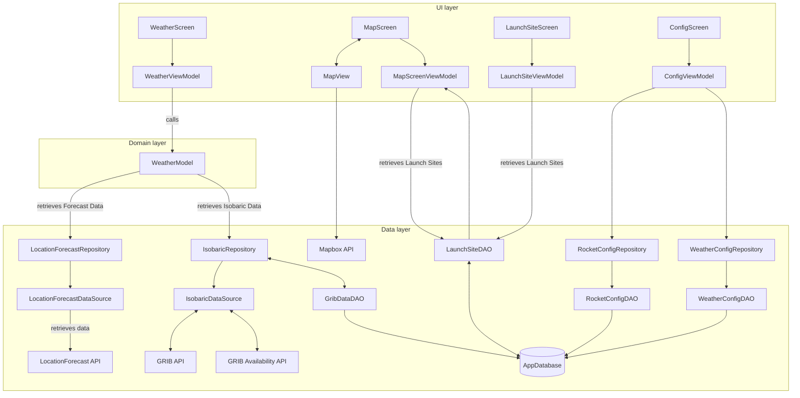

- [Introduction](#introduction)
- [Architecture](#architecture)
- [Architecture sketch/diagram](#architecture-sketch/diagram)
- [Project structure](#project-structure)
- [Object-Oriented principles](#object-oriented-principles)
  - [Low coupling](#low-coupling)
  - [High cohesion](#high-cohesion)
- [Design Patterns](#design-patterns)
  - [MVVM (Model-View-ViewModel)](#mvvm(model-view-viewmodel))
  - [Repository pattern](#repository-pattern)
  - [UDF (Unidirectional Data Flow)](#design-patterns---udf (unidirectional-data-flow))
- [Technologies and frameworks](#technologies-and-frameworks)
- [Architectural Details](#architectural-details)
  - [MVVM](#mvvm)
  - [Repository/DataSource](#repository/datasource)
  - [GRIB Handling](#grib-handling)
  - [Compose + Mapbox](#architectural-details---compose+mapbox)
- [API level](#api-level)
  - [Minimum SDK](#minimum-sdk)
  - [Target SDK](#target-sdk)
- [Recommendations for future development](#recommendations-for-future-development)

## Introduction
This document provides an overview of the chosen architecture, the structure of the project, and the coding practices that were followed, along with reasoning for the decisions made during development. It is intended for developers who will continue working on, maintaining, or extending the application.

It also highlights how core object-oriented principles such as low coupling, high cohesion, and reusability as well as design patterns like MVVM and UDF are upheld throughout the code.

### Architecture
The application follows the MVVM (Model-View-ViewModel) architecture, which promotes low coupling between components and high cohesion within modules. This structure improves testability, maintainability, and scalability.
- **Model**: Contains business logic, data models, and handles both local and remote data sources.
- **ViewModel**: Acts as a bridge between the Model and the View. It fetches and transforms data into UI-friendly formats and contains logic for UI interactions.
- **View**: Consists of UI elements and screen components that observe the ViewModel and reactively update the user interface.

### Project structure
The project is organized into distinct layers to promote modularity:

**data/**
- Handles all data operations, both remote and local.
  - models/: Domain and data models organized by feature (GRIB, isobaric, locationforecast, safetyevaluation, sunrise).
  -   remote/: Data sources and repositories for network/API communication using Ktor clients.
  -   local/: Manages local data sources such as database, configuration profiles, and launch site info. Room (a SQLite-based database) is used to store information like launch sites, weather configurations, and GRIB data locally, with type-safe queries via DAO interfaces.

**di/**
- AppModule.kt configures all dependencies using Hilt (including Room and Ktor clients).

**domain/** 
- Includes business logic and helper classes:
  - helpers/: Contains core components like WeatherModel, IsobaricInterpolator, and TrajectoryCalculator for scientific computations.
  - helperclasses/: General utilities like SimpleLinkedList.
  
**ui/**
- All UI code, built with Jetpack Compose. Organized by screens and shared components:
  - screens/: Each screen (for example weatherScreen, mapScreen) has its own folder containing components and ViewModels.
  - common/, navigation/, theme/: Shared UI components, navigation setup, and app-wide styling.

### Architecture sketch/diagram

### Object-Oriented principles
The codebase is designed with strong adherence to low coupling, where clear separation of concerns ensures modules can evolve independently. As well as high cohesion, where each class or component has a single, well-defined responsibility. 
Along with reusability where UI components such as WeatherLoadingSpinner, AppOutLinedTextField are designed for reuse across multiple screens if needed.

**Low coupling** is achieved using Hilt, which injects repositories/data sources automatically, and by ensuring layers are isolated and communicate only through well-defined interfaces.

**High cohesion** is made possible by folders and components that are organised by single responsibility. As an example, weather data is only in WeatherModel, whilst the map logic is within the MapScreen.

The design patterns **MVVM** and **UDF** are consistently used along with the repository/data source pattern to separate networking and caching. 

### Design Patterns
**MVVM (Model-View-ViewModel)**
- Used to separate the user interface, application logic, and data layers.
  - **Model (Data/Domain)**: Handles data storage, API communication, and domain-specific logic.
  - **ViewModel**: Connects the data to the UI by exposing observable state using StateFlow.
  - **View**: Observes ViewModel state and reacts to changes.

**Repository pattern**
- Used to abstract and centralize data operations. Found in data/remote and data/local, it ensures that the rest of the app interacts with a clean API regardless of the data source.

**UDF (Unidirectional Data Flow)**
- Data flows one way from the ViewModel to the UI. The ViewModel handles logic and updates the UI state, which the View observes. UI events are then sent back to the ViewModel. This ensures a predictable and maintainable flow of data.

The benefits of these design patterns are easy debugging, a clear data flow and high modularity, which is why these have been chosen.

### Technologies and frameworks
- **Jetpack Compose**: Manages the entire UI layer.
- **Hilt**: Dependency Injection framework that automatically provides and injects components.
- **Ktor**: HTTP client used for fetching JSON and binary weather data.
- **Room**: Local database management built on SQLite, with support for type-safe queries and data persistence.
- **Mapbox Compose**: Handles all map-related UI such as displaying launch sites and trajectories.
- **GRIB & NetCDF**: GRIB is a binary weather data format. The app uses NetCDF libraries to parse GRIB2 files into usable meteorological data.
- **Coil**: Image loading and additional UI enhancements.

### Architectural Details
- **MVVM**: ViewModels (for example WeatherViewModel) combine multiple data sources and manage screen state.
- **Repository/DataSource**: For example, LocationForecastRepository handles caching and fetches data via LocationForecastDataSource using Ktor.
- **GRIB Handling**: IsobaricRepository downloads GRIB2 files and parses them with NetCDF. Parsed data is stored in Room for efficient reuse.
- **Compose + Mapbox**: UI is fully built using Jetpack Compose. Map-related features like markers and trajectory paths are handled using Mapbox Compose.

### API level
- **Minimum SDK**: 26 (Android 8.0 Oreo)
  - Required due to GRIB parsing and certain Mapbox Compose functions that depend on newer Android capabilities.
- **Target SDK**: 35 (latest available version)

This ensures support for modern Android features while maintaining compatibility with a wide range of devices. GRIB parsing and trajectory calculations are computationally intensive and must be performed on-device. While separating this logic to a backend service would be optimal in other contexts, the current design ensures all processing happens directly on the phone. Which is important for real-time operation and offline use cases, even if some performance trade-offs exist.

### Recommendations for future development
The architecture has been designed to support long-term development by keeping components loosely coupled and responsibilities clearly separated. 
By following the MVVM and UDF patterns, along with the repository/data source structure, developers can easily make changes without affecting unrelated parts of the system.

**To make development smoother**:
- Follow the established folder structure. For example, place new screens in ui/screens/ and create reusable UI components in common/.
- Use Hilt for dependency injection to manage object lifecycles and reduce repetitive setups.
- Reuse helper classes from domain/helperclasses/ to avoid duplicating logic and keep the code clean.

**Some key considerations for further development**:
- GRIB parsing and related data processing must run directly on the device due to requirements from the Mapbox functionality. While offloading this to an external service could improve performance, it would not be possible for this application since the results need to be available on the phone.
- Some operations, such as weather data processing and trajectory calculations, are heavy and best suited for modern Android devices (API 26+).
- Reuse components where possible. UI elements like AppOutLinedTextField are built for reuse and should be preferred to ensure consistency across the app.
