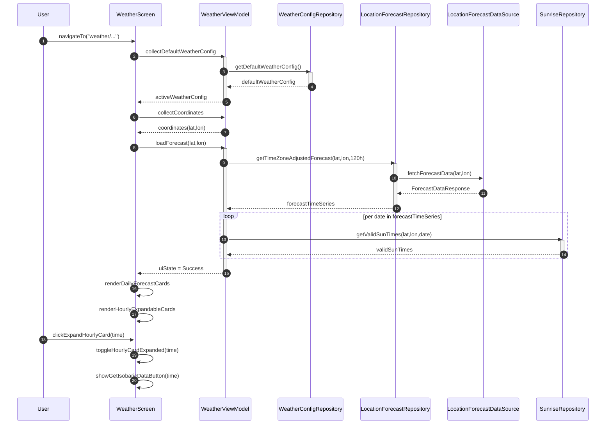
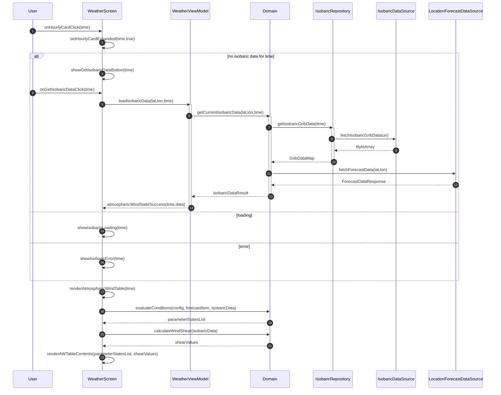
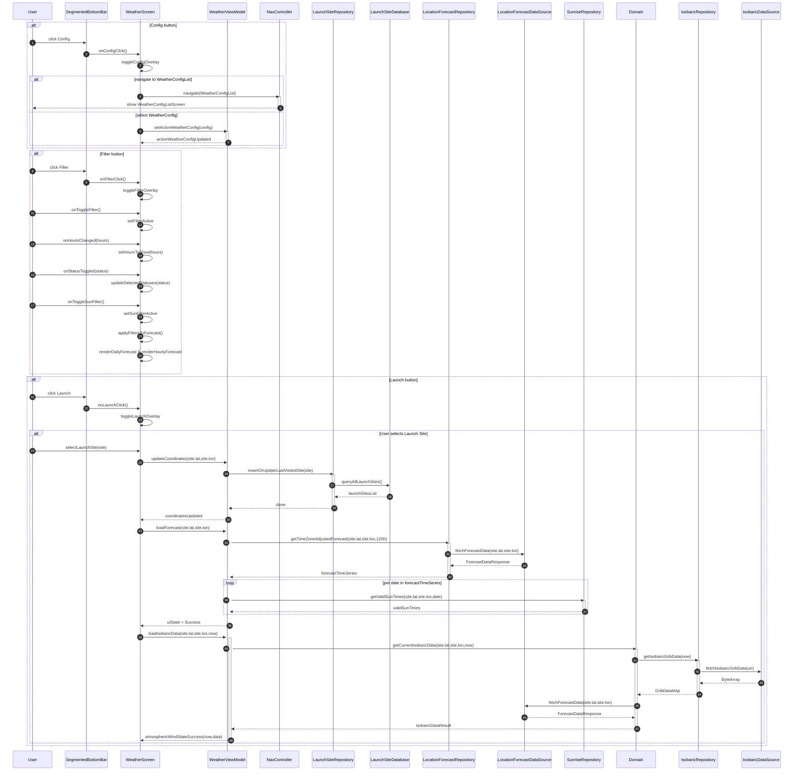

> **Disclaimer**  
> The following diagrams are intended to illustrate the conceptual architecture and flow of data within the main components of the app, specifically the `WeatherScreen`, `MapScreen`, and `ConfigScreens`, and their interaction with backend systems.  
> Please note:
> - The diagrams are based on the current design and may not reflect future changes or refactorings.
> - Diagram content is simplified for clarity and may omit certain details such as error handling, concurrency, or edge cases.

# Weather Screen
### Weather Screen Navigation and initialization

### Weather Screen - Hourly Card and Isobaric Data rendering

### Segmented Bottom Bar interactions

