> **Disclaimer**  
> The following diagrams are intended to illustrate the conceptual architecture and flow of data within the main components of the app, specifically the `WeatherScreen`, `MapScreen`, and `ConfigScreens`, and their interaction with backend systems.  
> - The diagrams are based on the current design and may not reflect future changes or refactorings.
> - Diagram content is simplified for clarity and may omit certain details such as error handling, concurrency, or edge cases.
# Map Screen
### App launch -> MapScreen
* **App launch & navigation setup:** When the user opens the app, `MainActivity.onCreate()` sets the Compose content to `App()`, which wraps everything in `AppScaffold` (app-wide theming) and then instantiates the `NavigationGraph` with `"maps"` as the start destination—so the `NavHostController` immediately shows `MapScreen` with its ViewModel and navigation callbacks.
* **MapScreen initialization & data load:** As soon as `MapScreen` is composed, it calls `viewModel.loadLaunchSites()`, which asks `LaunchSitesRepository` to fetch all sites via the Room DAO (`queryAllLaunchSites()`), and the resulting list is emitted back to the screen as `uiState = Success(launchSitesList)`.
* **MapView composition:** Once the launch-sites data is available, `MapScreen` composes its `MapView`, passing in the current map center and the loaded `launchSites`, so the map can render markers immediately.

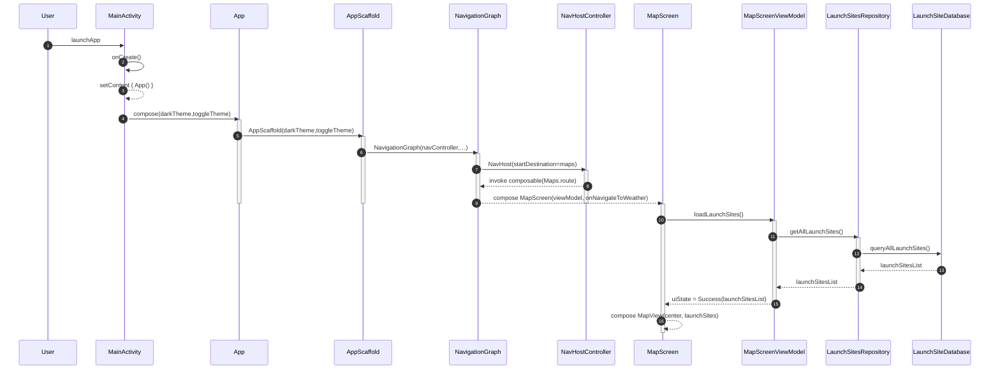

### MapScreen - MarkerAnnotation and LaunchSite handling
* **Long-press placeholder creation:** When the user long-presses on the map, `MapView` calls `MapScreen.onMarkerPlaced`, which delegates to the ViewModel’s `onMarkerPlaced(lat, lon)`. The ViewModel first updates the “Last Visited” placeholder (inserting or updating a LaunchSite named “Last Visited” in the database), then does the same for the “New Marker” placeholder, and finally signals the screen that a new marker is ready.
* **Save dialog workflow:** Triggered separately (e.g. via a UI button), the screen shows `SaveLaunchSiteDialog` for the “New Marker.” When the user confirms a name, the dialog passes it back to `MapScreen`, which calls `viewModel.addLaunchSite(name, lat, lon)`. The ViewModel inserts a new `LaunchSite` entity into the repository/DAO/Room layers, then notifies the screen of success and hides the dialog.
* **Double-click annotation handling:** A double-click on any existing marker invokes `MapView` → `MapScreen.onSavedMarkerAnnotationClick(site)`, and the screen calls `viewModel.updateCoordinates(lat, lon)`. The ViewModel updates the “Last Visited” record in the database and returns, after which the screen eases the map camera to center on that site.
* **Launch-sites menu selection:** Tapping the launch-sites FAB shows `LaunchSitesMenu` with all saved sites. When the user selects one, `MapScreen.onSiteSelected(site)` calls `viewModel.updateCoordinates`, which updates the “Last Visited” entry; then the screen dismisses the menu and recenters the map on the chosen site.

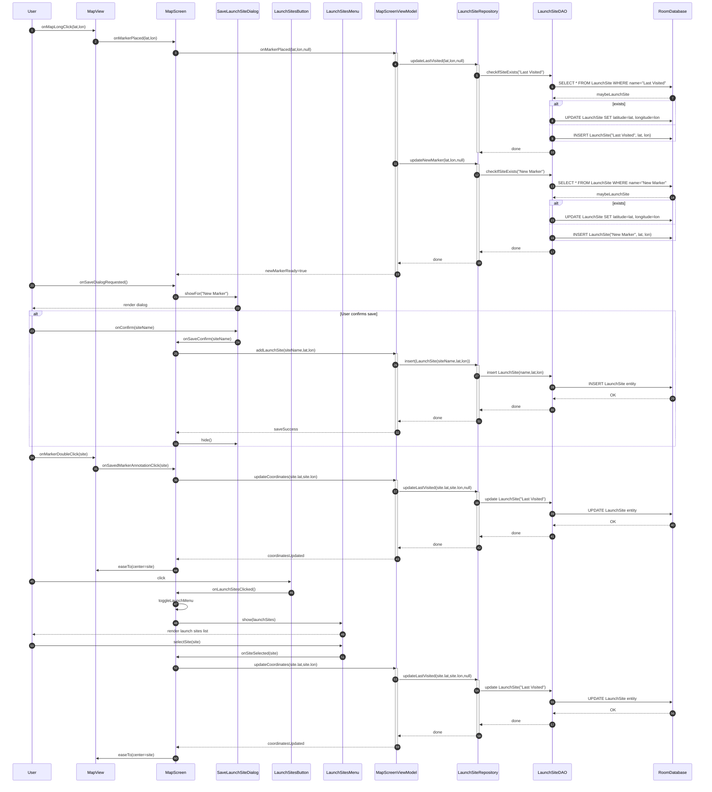

### MapScreen - MapView and Location selection and Trajectory Loading
* **Initialization & launch‐sites load:** When `MapScreen` is composed, it immediately calls `viewModel.loadLaunchSites()`, which invokes `LaunchSitesRepository.getAllLaunchSites()` to query the Room `LaunchSiteDao`. Once the list returns, the ViewModel emits `uiState = Success(launchSitesList)`, allowing the UI to render markers for saved sites.
* **MapView setup:** After launch‐site data is available, `MapScreen` composes `MapView(center, launchSites)`. `MapView` then loads the Mapbox style (satellite with terrain and sky) via `mapboxMap.loadStyle(...)` before rendering the map.
* **Trajectory options popup:** Tapping the “Trajectory” FAB triggers `showTrajectoryPopup()`. Within this overlay, users can select or edit rocket configurations and clear any existing trajectory; these UI actions dispatch to the ViewModel (`setSelectedConfig`, `clearTrajectory`) or navigate to the config list.
* **Trajectory calculation & data fetch:** When “Start Trajectory” is tapped, the ViewModel fetches the default rocket config, then calls `TrajectoryCalculator.calculateTrajectory()`. The calculator first fetches the full GRIB map (once) and then makes an initial grid of 16 forecast calls around the launch site; during simulation, it interpolates wind using the GRIB map and, whenever a quadrant boundary is crossed, fetches four additional forecast points from the `LocationForecastRepository`.
* **Render & animate trajectory:** After `trajectoryPoints` return, `MapScreen` passes them to `MapView.updateTrajectory()`, which loops over each point, adding a GeoJSON source and a 3D model layer at the correct altitude. Finally, `MapView` calls `mapboxMap.animateCameraAlong(trajectoryPoints)`, smoothly flying the camera along the path until completion.

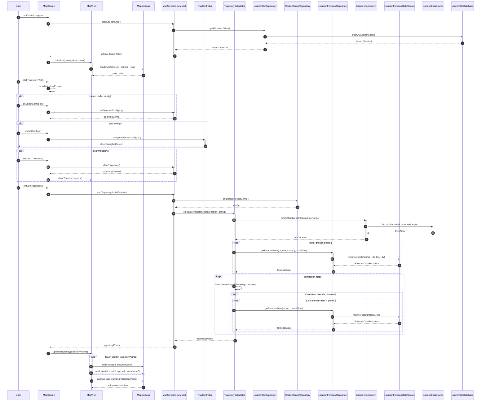

# Weather Screen
### Weather Screen Navigation and initialization
* **Navigation & configuration load:** When the user navigates to the Weather screen, the composable immediately asks the ViewModel for the default weather configuration. The ViewModel calls `WeatherConfigRepository.getDefaultWeatherConfig()` and returns the active config back to the UI.
* **Coordinates & forecast fetch:** The screen then collects the current coordinates from the ViewModel and instructs it to load a 120-hour forecast. The ViewModel fetches time-zone–adjusted forecast data from `LocationForecastRepository`, then for each date in the returned series it calls `SunriseRepository.getValidSunTimes()` before emitting a `Success` UI state.
* **Rendering forecast cards:** Once the UI state is `Success`, the screen composes its DailyForecastCards to show per-day summaries and HourlyExpandableCards for each hourly forecast item.
* **Hourly card initial state:** When the user taps to expand a specific hourly card, the UI toggles that card’s expanded state and displays a “Get Isobaric Data” button, allowing the user to trigger loading of upper-air wind data for that time slot.

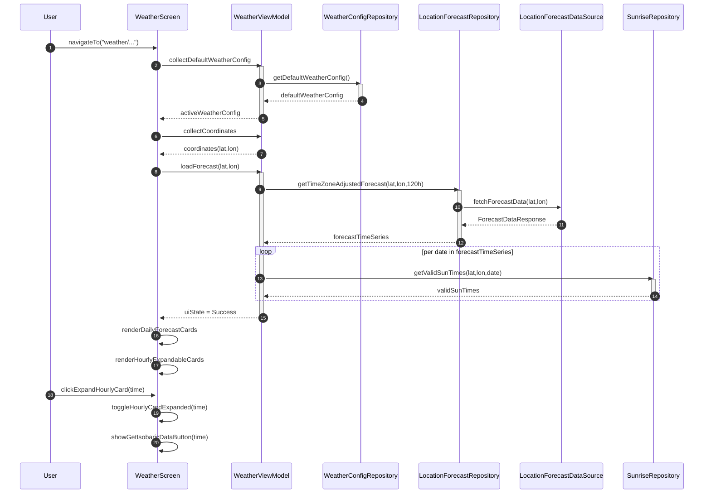

### Weather Screen - Hourly Card and Isobaric Data rendering
* **Hourly card expansion:** When the user taps an hourly card, the UI toggles that card’s expanded state and immediately shows a “Get Isobaric Data” button if no upper-air data is yet loaded.
* **Isobaric data fetch:** Clicking “Get Isobaric Data” calls `WeatherViewModel.loadIsobaricData(lat, lon, time)`, which delegates to the domain (`getCurrentIsobaricData`). The domain first loads raw GRIB wind data from the `IsobaricRepository`/`IsobaricDataSource`, then fetches surface forecast data from the `LocationForecastRepository`/`LocationForecastDataSource`.
* **Loading & error states:** While the ViewModel is fetching, the card displays a loading spinner; on failure, it shows an error message with a “Retry” button that re-invokes `loadIsobaricData`.
* **Displaying wind data table:** Once data arrives, the UI calls `evaluateConditions(config, forecastItem, isobaricData)` and `calculateWindShear(isobaricData)` on the domain, then passes the resulting parameter states and shear values into `AWTableContents` to render the detailed atmospheric-wind table.

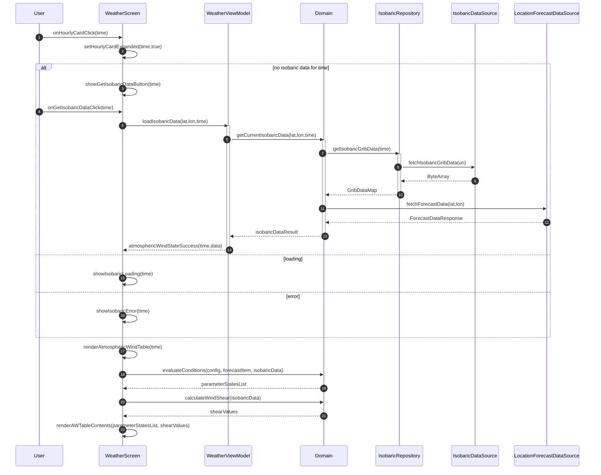

### Segmented Bottom Bar interactions
* **Config button interactions:** When the user taps the Config button, `WeatherScreen.onConfigClick()` toggles the configuration overlay. If they choose “Edit Configs,” the UI calls `NavController.navigate(WeatherConfigList)`; if they select a specific configuration, `WeatherVM.setActiveWeatherConfig(cfg)` updates the active config in the ViewModel and re-renders the screen.
* **Filter button interactions:** Tapping the Filter button invokes `WeatherScreen.onFilterClick()`, opening the filter overlay. User actions (`onToggleFilter`, `onHoursChanged`, `onStatusToggled`, `onToggleSunFilter`) update the UI’s filter state, and calling `applyFiltersToForecast()` recomputes which daily and hourly cards are shown before re-rendering them.
* **Launch button interactions:** When the Launch button is tapped, `WeatherScreen.onLaunchClick()` displays the launch-sites overlay. Selecting a site calls `WeatherVM.updateCoordinates(site.lat, site.lon)`, which inserts or updates the “Last Visited” site in `LaunchSiteRepository` and then triggers `loadForecast(lat, lon)`. After the forecast data loads, `WeatherScreen.loadIsobaricData()` fetches upper-air wind data and updates the cards with `atmosphericWindStateSuccess`.

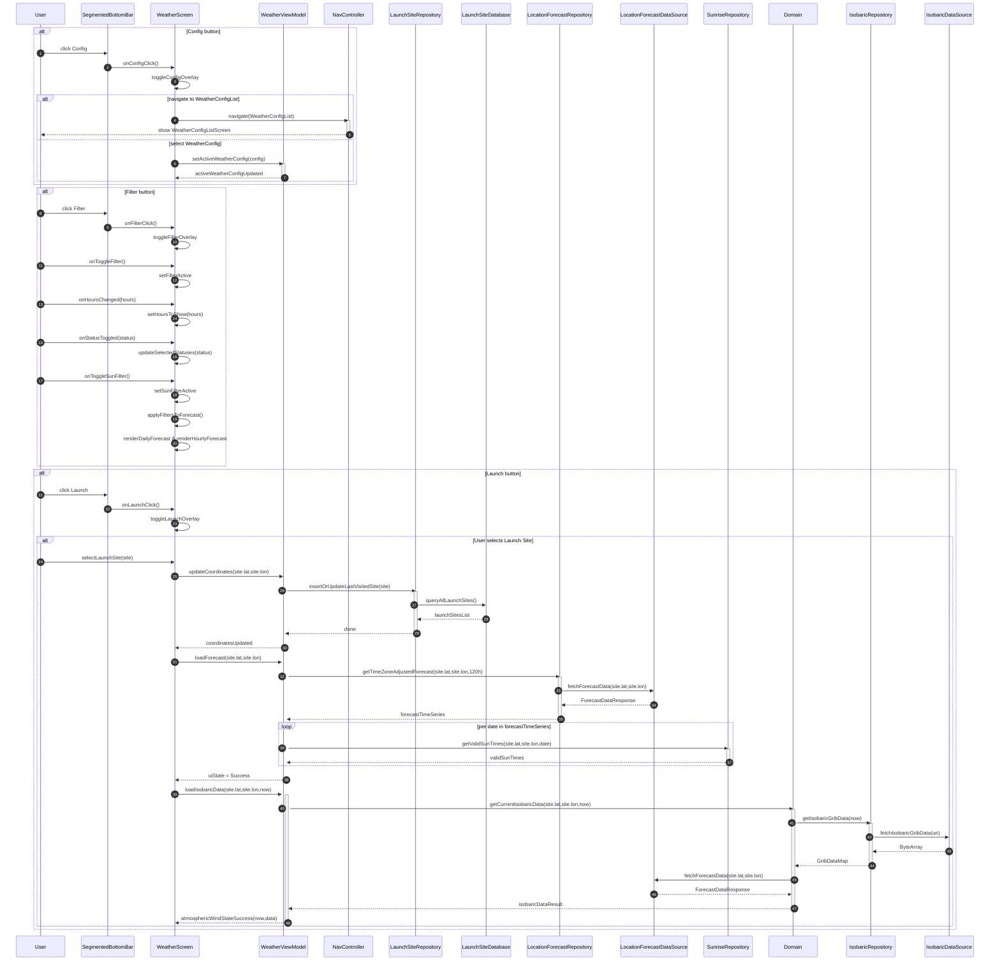
# Rocket Config
### Rocket Config List Screen
* **Screen initialization:** When the user opens the Rocket Config List screen, the UI calls `ConfigViewModel.getAllRocketConfigs()`. The ViewModel delegates to `RocketConfigRepository.findAllRocketConfigs()`, which queries the DAO (`SELECT * FROM rocket_config`) and returns the list to the ViewModel, which then emits it back to the UI.
* **Set default configuration:** If the user taps a non-default config, the UI invokes `ConfigViewModel.setDefaultRocketConfig(id)`. The ViewModel calls the repository’s `setDefaultRocketConfig(id)`, which runs two DAO updates—first clearing the old default, then marking the selected config—and finally notifies the ViewModel. The UI then navigates back.
* **Delete configuration:** When the user deletes a config, the UI calls `ConfigViewModel.deleteRocketConfig(cfg)`. The ViewModel instructs the repository to delete it via the DAO (`DELETE FROM rocket_config WHERE id=…`), and upon completion the ViewModel refreshes the list in the UI.
* **Add new configuration:** Tapping the “+” button navigates from the list screen to the Rocket Config Edit screen with no existing parameters, allowing the user to create a brand‐new configuration.

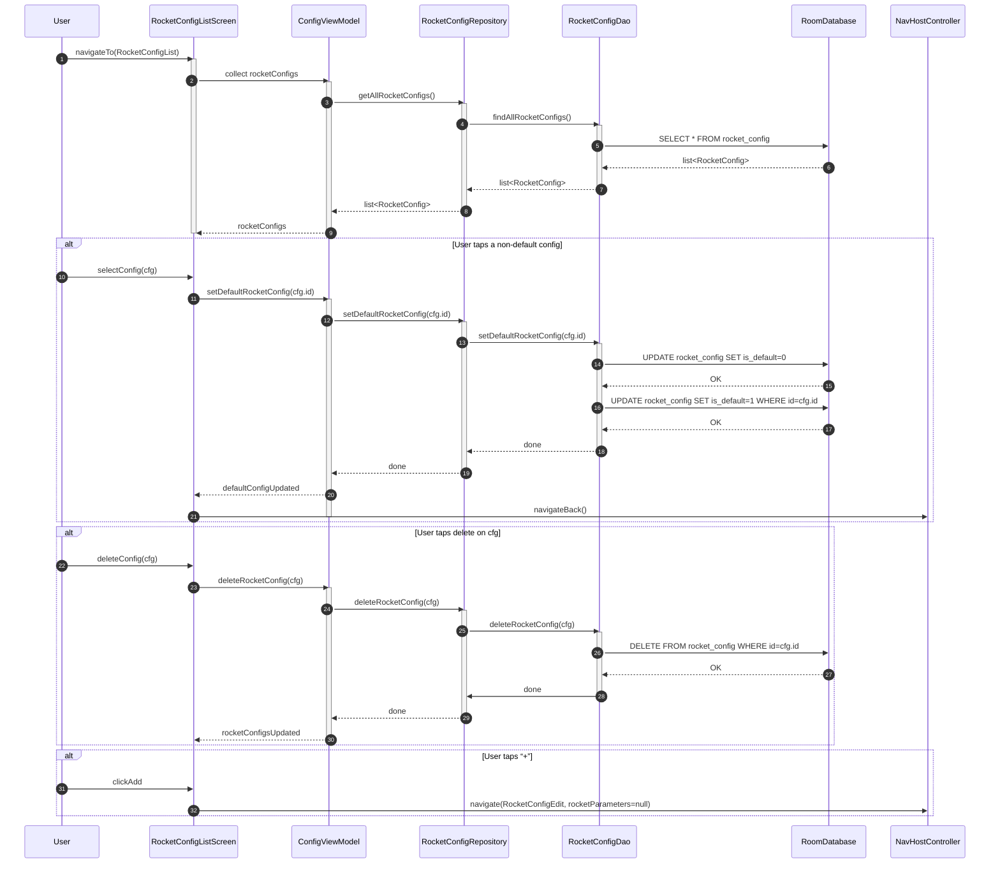

### Rocket Config Edit Screen
* **Screen initialization:** When navigating to the edit screen (with an optional existing `rocketParameters`), the UI subscribes to `ConfigViewModel.rocketUpdateStatus`. The ViewModel immediately emits the current update status (Idle, Loading, etc.) so the UI can show any initial loading or error indicators.
* **Name uniqueness check:** As the user types a configuration name, the UI calls `checkRocketNameAvailability(name)` on the ViewModel. The ViewModel fetches all existing names from `RocketConfigRepository` → DAO (`SELECT name FROM rocket_config`) and returns an availability status to the UI, enabling real-time validation feedback.
* **Saving or updating:** When the user taps “Save,” the UI invokes `ConfigViewModel.saveOrUpdateRocketConfig(rc)`. The ViewModel branches on whether `rc.id` is null (insert) or not (update), then calls the repository’s corresponding DAO operation (`INSERT` or `UPDATE rocket_config`). Once the database operation completes successfully, the ViewModel emits `updateStatus = Success`.
* **Navigation on success:** After `updateStatus` transitions to Success, the edit screen calls `NavController.navigateBack()` to return to the config list, reflecting the newly created or updated configuration.

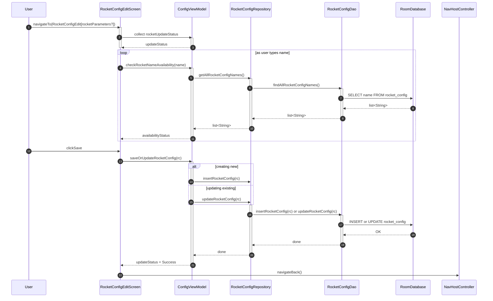

# Weather Config
### Weather Config List Screen
* **Screen initialization:** When the Weather Config List screen is opened, it calls `ConfigViewModel.getAllWeatherConfigs()`. The ViewModel delegates to `WeatherConfigRepository.findAllWeatherConfigs()`, which queries the DAO (`SELECT * FROM weather_config`) and returns the full list to the UI.
* **Set default configuration:** If the user taps a non-default config, the UI invokes `ConfigViewModel.setDefaultWeatherConfig(id)`. The ViewModel tells the repository to clear the old default (`UPDATE weather_config SET is_default=0`) and mark the chosen config as default (`UPDATE weather_config SET is_default=1 WHERE id=…`), then notifies the UI and navigates back.
* **Delete configuration:** When the user deletes a config, the UI calls `ConfigViewModel.deleteWeatherConfig(cfg)`. The ViewModel instructs the repository to remove it via the DAO (`DELETE FROM weather_config WHERE id=…`), and once that completes the ViewModel updates the list in the UI.
* **Add new configuration:** Tapping the “+” button navigates from the list screen to the Weather Config Edit screen with no existing config data, allowing the user to create a brand-new weather configuration.

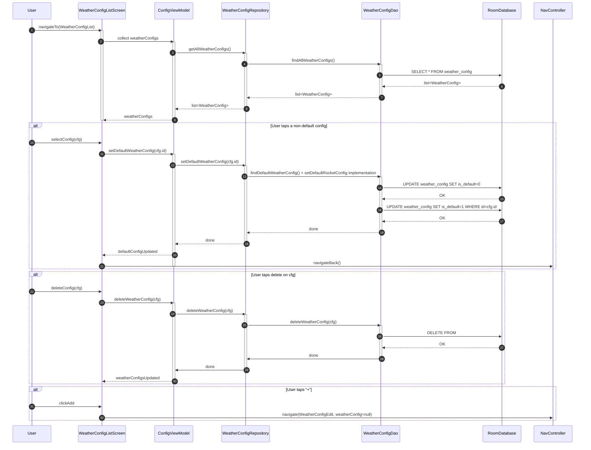

### Weather Config Edit Screen
* **Screen initialization:** Upon navigation to the Weather Config Edit screen (with an optional existing config), the UI subscribes to `ConfigViewModel.weatherUpdateStatus`, and the ViewModel immediately emits its current status so the screen can show loading or error indicators as needed.
* **Name uniqueness check:** As the user types the configuration name, the UI calls `checkWeatherNameAvailability(name)` on the ViewModel, which fetches all existing names from `WeatherConfigRepository` → DAO (`SELECT name FROM weather_config ORDER BY name`) and returns an availability status for real-time validation.
* **Saving or updating:** When “Save” is tapped, the UI invokes `ConfigViewModel.saveOrUpdateWeatherConfig(cfg)`. The ViewModel determines whether to insert or update, calls the repository’s corresponding DAO method (`INSERT` or `UPDATE weather_config`), and upon success emits `updateStatus = Success`.
* **Navigation on success:** After the ViewModel signals a successful save, the edit screen calls `NavController.navigateBack()` to return to the list, reflecting the newly created or updated weather configuration.

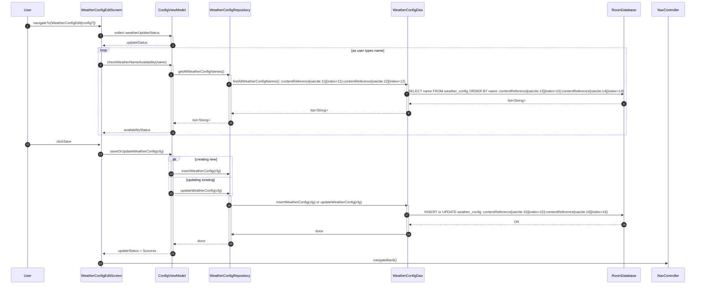

# Class diagrams
### Map Screen
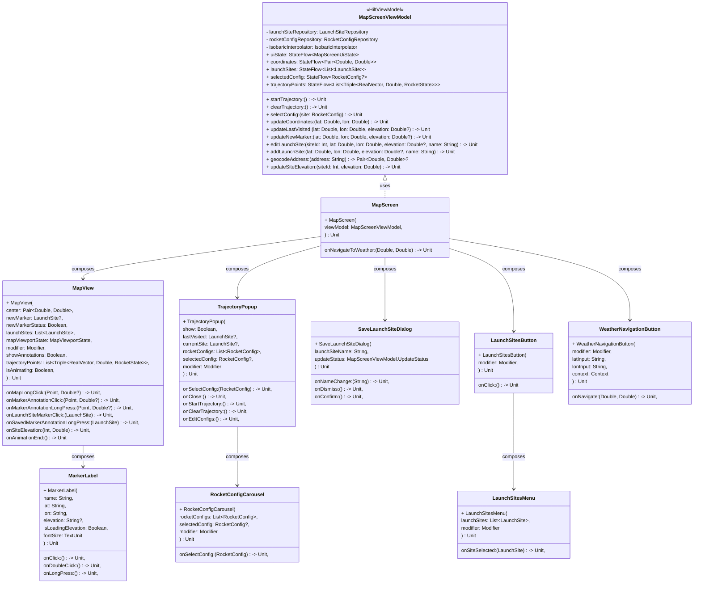

### Weather Screen
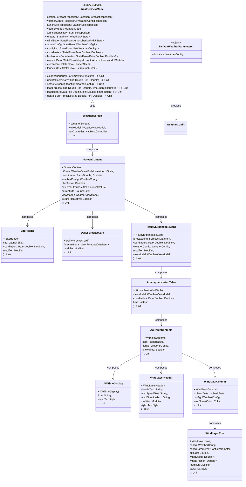

### Segmented bottom bar
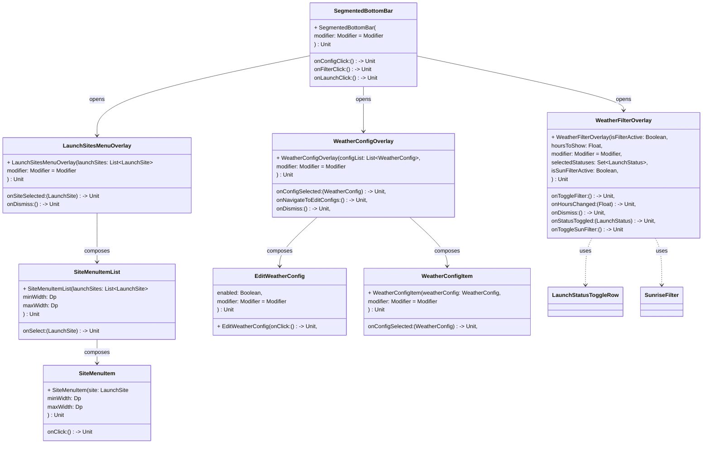

### Configuration classes
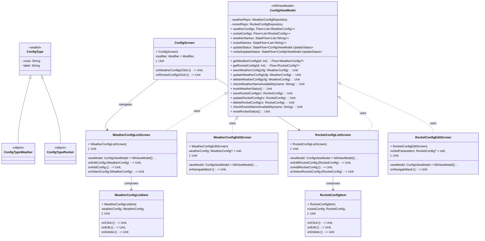
## Navigation
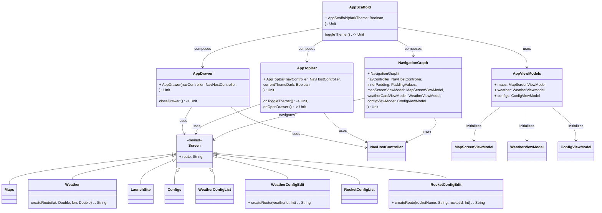