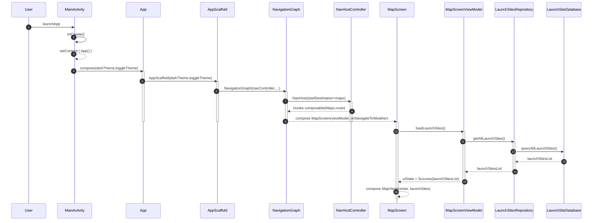
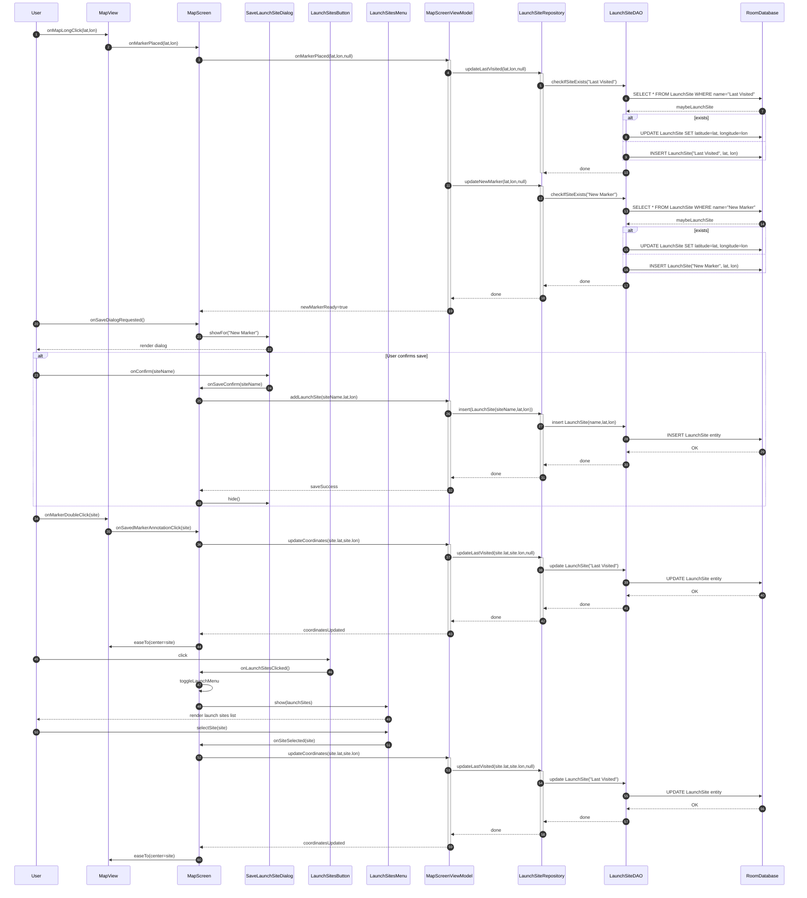
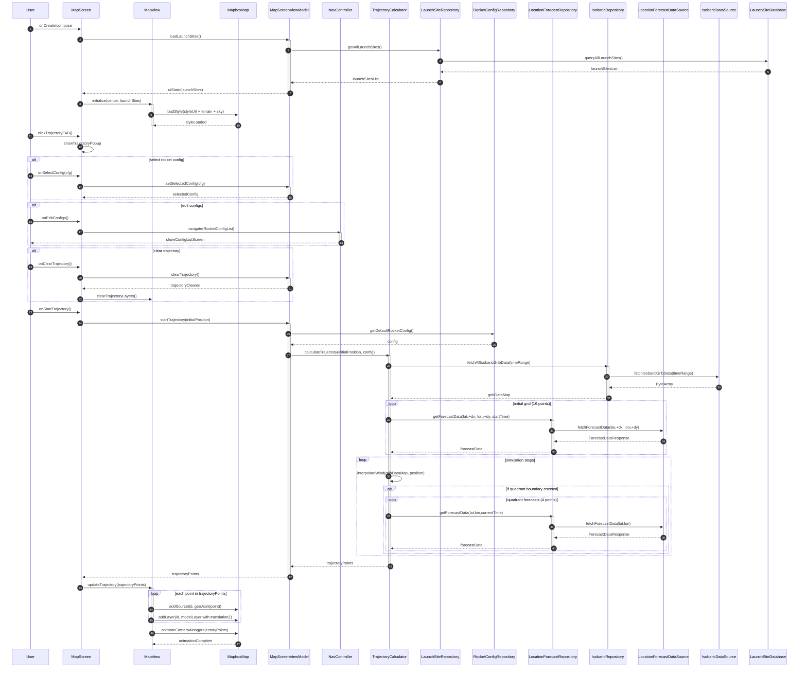
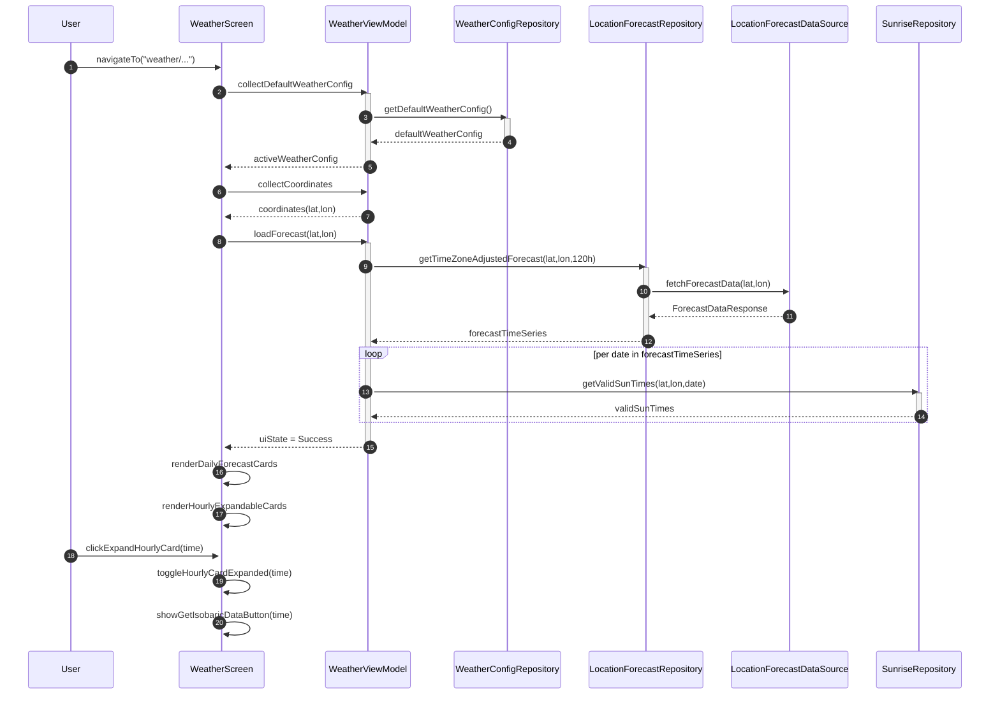
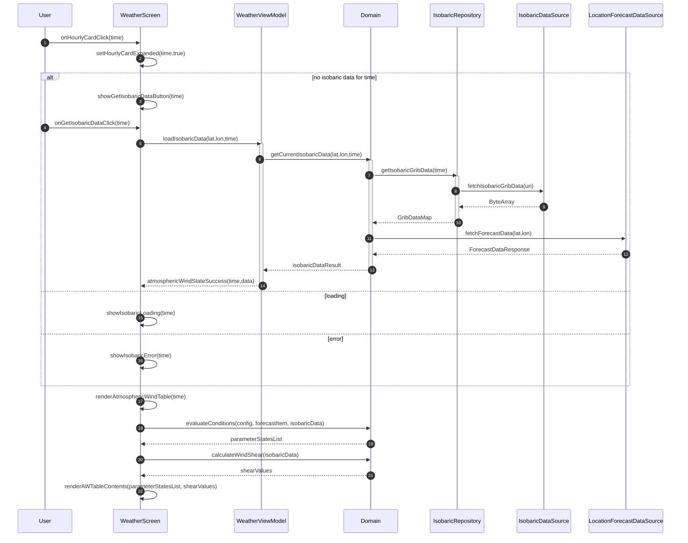
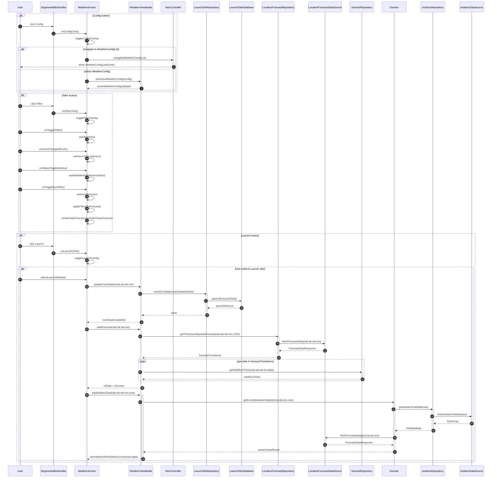
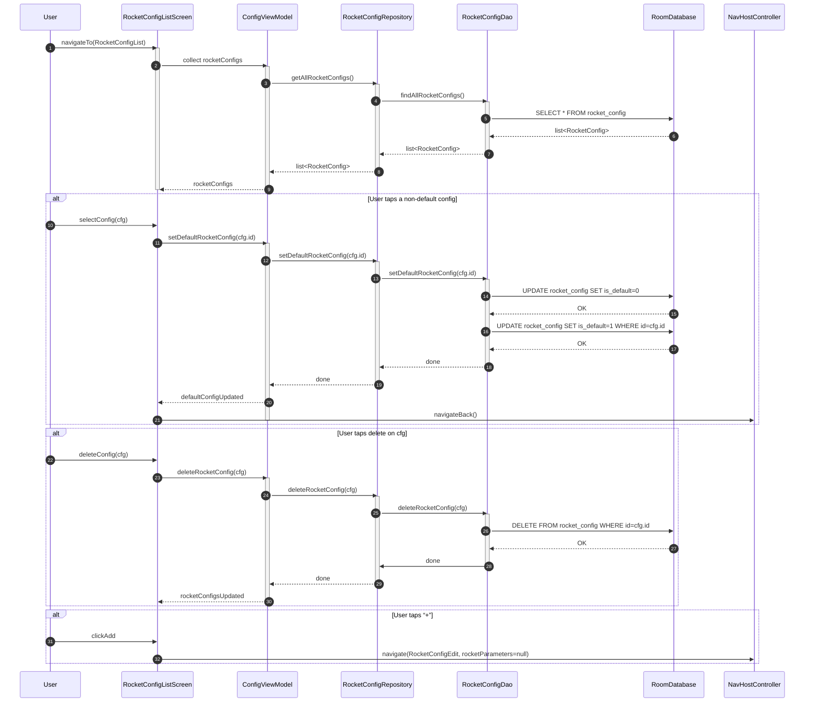
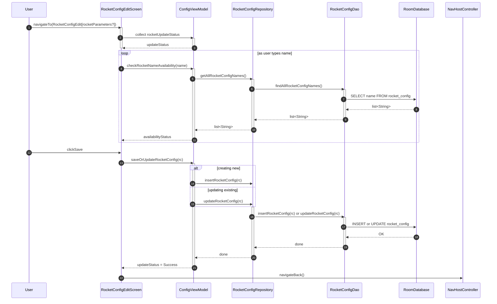
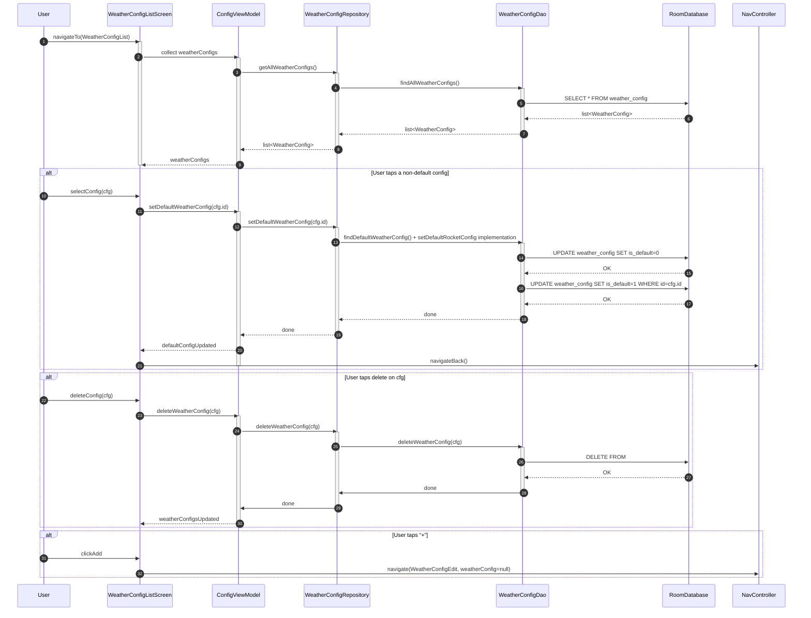
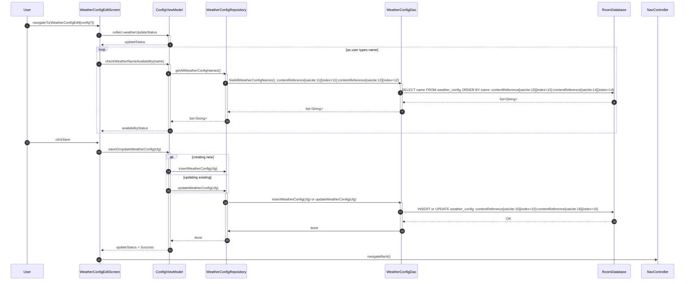

> **Disclaimer**  
> The following diagrams are intended to illustrate the conceptual architecture and flow of data within the main components of the app, specifically the `WeatherScreen`, `MapScreen`, and `ConfigScreens`, and their interaction with backend systems.  
> - The diagrams are based on the current design and may not reflect future changes or refactorings.
> - Diagram content is simplified for clarity and may omit certain details such as error handling, concurrency, or edge cases.
# Map Screen
### App launch -> MapScreen
* **App launch & navigation setup:** When the user opens the app, `MainActivity.onCreate()` sets the Compose content to `App()`, which wraps everything in `AppScaffold` (app-wide theming) and then instantiates the `NavigationGraph` with `"maps"` as the start destination—so the `NavHostController` immediately shows `MapScreen` with its ViewModel and navigation callbacks.
* **MapScreen initialization & data load:** As soon as `MapScreen` is composed, it calls `viewModel.loadLaunchSites()`, which asks `LaunchSitesRepository` to fetch all sites via the Room DAO (`queryAllLaunchSites()`), and the resulting list is emitted back to the screen as `uiState = Success(launchSitesList)`.
* **MapView composition:** Once the launch-sites data is available, `MapScreen` composes its `MapView`, passing in the current map center and the loaded `launchSites`, so the map can render markers immediately.

### MapScreen - MarkerAnnotation and LaunchSite handling
* **Long-press placeholder creation:** When the user long-presses on the map, `MapView` calls `MapScreen.onMarkerPlaced`, which delegates to the ViewModel’s `onMarkerPlaced(lat, lon)`. The ViewModel first updates the “Last Visited” placeholder (inserting or updating a LaunchSite named “Last Visited” in the database), then does the same for the “New Marker” placeholder, and finally signals the screen that a new marker is ready.
* **Save dialog workflow:** Triggered separately (e.g. via a UI button), the screen shows `SaveLaunchSiteDialog` for the “New Marker.” When the user confirms a name, the dialog passes it back to `MapScreen`, which calls `viewModel.addLaunchSite(name, lat, lon)`. The ViewModel inserts a new `LaunchSite` entity into the repository/DAO/Room layers, then notifies the screen of success and hides the dialog.
* **Double-click annotation handling:** A double-click on any existing marker invokes `MapView` → `MapScreen.onSavedMarkerAnnotationClick(site)`, and the screen calls `viewModel.updateCoordinates(lat, lon)`. The ViewModel updates the “Last Visited” record in the database and returns, after which the screen eases the map camera to center on that site.
* **Launch-sites menu selection:** Tapping the launch-sites FAB shows `LaunchSitesMenu` with all saved sites. When the user selects one, `MapScreen.onSiteSelected(site)` calls `viewModel.updateCoordinates`, which updates the “Last Visited” entry; then the screen dismisses the menu and recenters the map on the chosen site.

### MapScreen - MapView and Location selection and Trajectory Loading
* **Initialization & launch‐sites load:** When `MapScreen` is composed, it immediately calls `viewModel.loadLaunchSites()`, which invokes `LaunchSitesRepository.getAllLaunchSites()` to query the Room `LaunchSiteDao`. Once the list returns, the ViewModel emits `uiState = Success(launchSitesList)`, allowing the UI to render markers for saved sites.
* **MapView setup:** After launch‐site data is available, `MapScreen` composes `MapView(center, launchSites)`. `MapView` then loads the Mapbox style (satellite with terrain and sky) via `mapboxMap.loadStyle(...)` before rendering the map.
* **Trajectory options popup:** Tapping the “Trajectory” FAB triggers `showTrajectoryPopup()`. Within this overlay, users can select or edit rocket configurations and clear any existing trajectory; these UI actions dispatch to the ViewModel (`setSelectedConfig`, `clearTrajectory`) or navigate to the config list.
* **Trajectory calculation & data fetch:** When “Start Trajectory” is tapped, the ViewModel fetches the default rocket config, then calls `TrajectoryCalculator.calculateTrajectory()`. The calculator first fetches the full GRIB map (once) and then makes an initial grid of 16 forecast calls around the launch site; during simulation, it interpolates wind using the GRIB map and, whenever a quadrant boundary is crossed, fetches four additional forecast points from the `LocationForecastRepository`.
* **Render & animate trajectory:** After `trajectoryPoints` return, `MapScreen` passes them to `MapView.updateTrajectory()`, which loops over each point, adding a GeoJSON source and a 3D model layer at the correct altitude. Finally, `MapView` calls `mapboxMap.animateCameraAlong(trajectoryPoints)`, smoothly flying the camera along the path until completion.

# Weather Screen
### Weather Screen Navigation and initialization

### Weather Screen - Hourly Card and Isobaric Data rendering

### Segmented Bottom Bar interactions

# Rocket Config
### Rocket Config List Screen

### Rocket Config Edit Screen

# Weather Config
### Weather Config List Screen

### Weather Config Edit Screen
