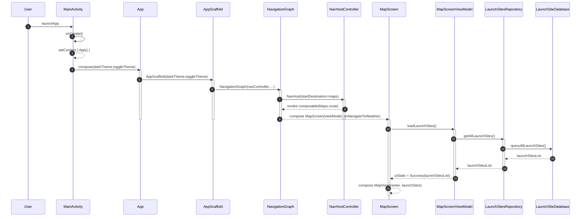
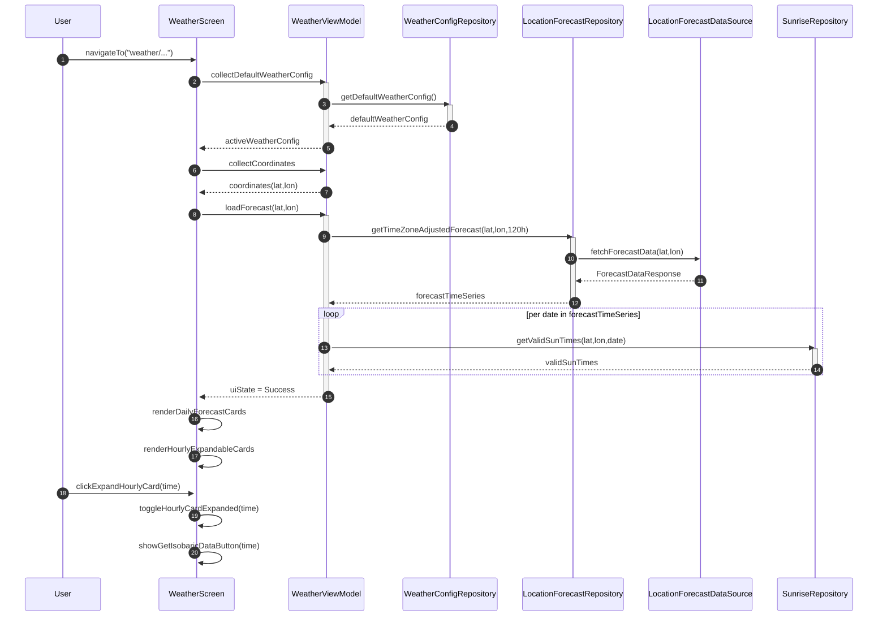
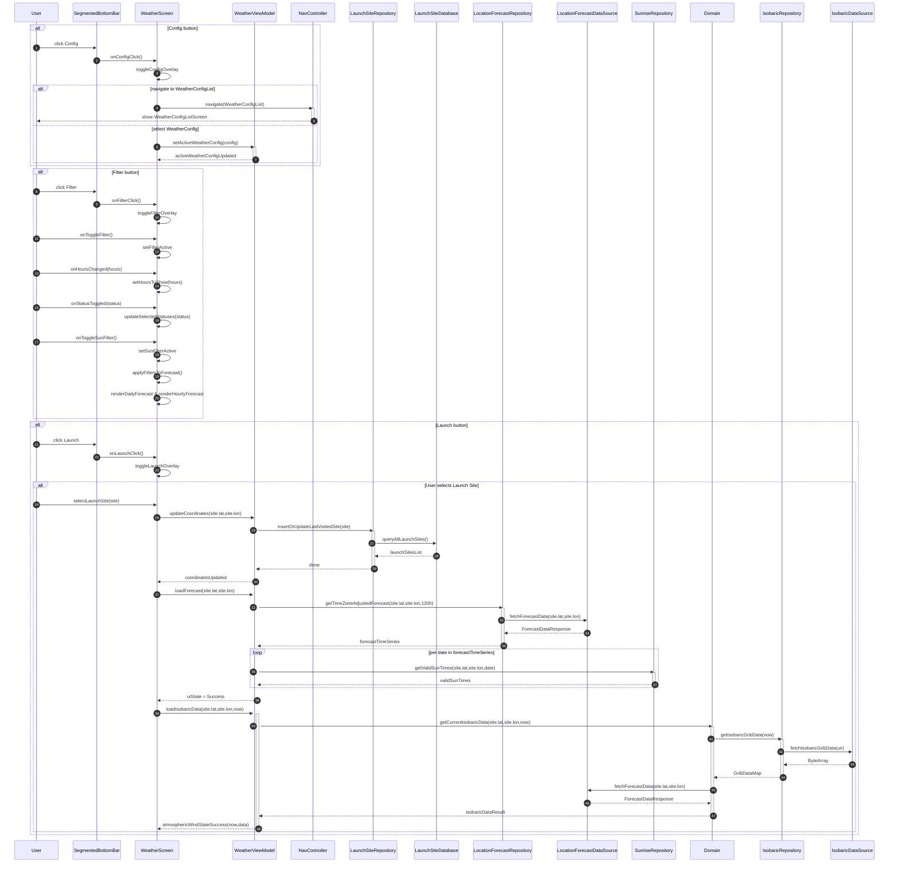

> **Disclaimer**  
> The following diagrams are intended to illustrate the conceptual architecture and flow of data within the main components of the app, specifically the `WeatherScreen`, `MapScreen`, and `ConfigScreens`, and their interaction with backend systems.  
> - The diagrams are based on the current design and may not reflect future changes or refactorings.
> - Diagram content is simplified for clarity and may omit certain details such as error handling, concurrency, or edge cases.
# Map Screen
### App launch -> MapScreen


### MapScreen - MarkerAnnotation and LaunchSite handling
```mermaid
sequenceDiagram
    autonumber
    participant User
    participant MapView
    participant MapScreen
    participant SaveDialog as SaveLaunchSiteDialog
    participant LSButton as LaunchSitesButton
    participant LSM as LaunchSitesMenu
    participant VM as MapScreenViewModel
    participant Repo as LaunchSiteRepository
    participant DAO as LaunchSiteDAO
    participant DB as RoomDatabase


    %% 1) Map long-press: placeholder creation only
    User->>MapView: onMapLongClick(lat,lon)  
    MapView->>MapScreen: onMarkerPlaced(lat,lon)  
    MapScreen->>VM: onMarkerPlaced(lat,lon,null)  
    activate VM
    VM->>Repo: updateLastVisited(lat,lon,null)  
    activate Repo
    Repo->>DAO: checkIfSiteExists("Last Visited")
    DAO->>DB: SELECT * FROM LaunchSite WHERE name="Last Visited"
    DB-->>DAO: maybeLaunchSite
    alt exists
        DAO->>DB: UPDATE LaunchSite SET latitude=lat, longitude=lon
    else
        DAO->>DB: INSERT LaunchSite("Last Visited", lat, lon)
    end
    DAO-->>Repo: done
    deactivate Repo

    VM->>Repo: updateNewMarker(lat,lon,null)  
    activate Repo
    Repo->>DAO: checkIfSiteExists("New Marker")
    DAO->>DB: SELECT * FROM LaunchSite WHERE name="New Marker"
    DB-->>DAO: maybeLaunchSite
    alt exists
        DAO->>DB: UPDATE LaunchSite SET latitude=lat, longitude=lon
    else
        DAO->>DB: INSERT LaunchSite("New Marker", lat, lon)
    end
    DAO-->>Repo: done
    Repo-->>VM: done
    deactivate Repo

    VM-->>MapScreen: newMarkerReady=true  
    deactivate VM

    %% 2) Save dialog triggered separately by user
    User->>MapScreen: onSaveDialogRequested()  
    MapScreen->>SaveDialog: showFor("New Marker")  
    SaveDialog-->>User: render dialog

    alt User confirms save
        User->>SaveDialog: onConfirm(siteName)  
        SaveDialog->>MapScreen: onSaveConfirm(siteName)  
        MapScreen->>VM: addLaunchSite(siteName,lat,lon)  
        activate VM
        VM->>Repo: insert(LaunchSite(siteName,lat,lon))  
        activate Repo
        Repo->>DAO: insert LaunchSite(name,lat,lon)
        DAO->>DB: INSERT LaunchSite entity
        DB-->>DAO: OK
        DAO-->>Repo: done
        Repo-->>VM: done
        deactivate Repo
        VM-->>MapScreen: saveSuccess  
        deactivate VM
        MapScreen->>SaveDialog: hide()
    end

    %% 3) Double-click existing marker updates Last Visited and centers map
    User->>MapView: onMarkerDoubleClick(site)  
    MapView->>MapScreen: onSavedMarkerAnnotationClick(site)  
    MapScreen->>VM: updateCoordinates(site.lat,site.lon)  
    activate VM
    VM->>Repo: updateLastVisited(site.lat,site.lon,null)  
    activate Repo
    Repo->>DAO: update LaunchSite("Last Visited")  
    DAO->>DB: UPDATE LaunchSite entity  
    DB-->>DAO: OK  
    DAO-->>Repo: done  
    Repo-->>VM: done  
    deactivate Repo
    VM-->>MapScreen: coordinatesUpdated  
    deactivate VM
    MapScreen->>MapView: easeTo(center=site)

    %% 4) Launch Sites menu selection updates Last Visited
    User->>LSButton: click  
    LSButton->>MapScreen: onLaunchSitesClicked()  
    MapScreen->>MapScreen: toggleLaunchMenu  
    MapScreen->>LSM: show(launchSites)  
    LSM-->>User: render launch sites list

    User->>LSM: selectSite(site)  
    LSM->>MapScreen: onSiteSelected(site)  
    MapScreen->>VM: updateCoordinates(site.lat,site.lon)  
    activate VM
    VM->>Repo: updateLastVisited(site.lat,site.lon,null)  
    activate Repo
    Repo->>DAO: update LaunchSite("Last Visited")  
    DAO->>DB: UPDATE LaunchSite entity  
    DB-->>DAO: OK  
    DAO-->>Repo: done  
    Repo-->>VM: done  
    deactivate Repo
    VM-->>MapScreen: coordinatesUpdated  
    deactivate VM
    MapScreen->>MapView: easeTo(center=site)
    ```

### MapScreen - MapView and Location selection and Trajectory Loading
```mermaid
---
config:
  theme: neo-dark
---
sequenceDiagram
    autonumber
    participant User
    participant MapScreen
    participant MapView
    participant Mapbox as MapboxMap
    participant VM as MapScreenViewModel
    participant NavCtrl as NavController
    participant Domain as TrajectoryCalculator
    participant LaunchRepo as LaunchSiteRepository
    participant RocketRepo as RocketConfigRepository
    participant LocRepo as LocationForecastRepository
    participant GRIBRepo as IsobaricRepository
    participant ForecastDS as LocationForecastDataSource
    participant IsobaricDS as IsobaricDataSource
    participant RoomDB as LaunchSiteDatabase

    %% 1) Initialization: load launch sites
    User->>MapScreen: onCreate/compose  
    activate MapScreen
    MapScreen->>VM: loadLaunchSites()  
    activate VM
    VM->>LaunchRepo: getAllLaunchSites()  
    LaunchRepo->>RoomDB: queryAllLaunchSites()  
    RoomDB-->>LaunchRepo: launchSitesList  
    LaunchRepo-->>VM: launchSitesList  
    VM-->>MapScreen: uiState(launchSites)  
    deactivate VM

    %% 2) MapView setup
    MapScreen->>MapView: initialize(center, launchSites)  
    activate MapView
    MapView->>Mapbox: loadStyle(styleUrl + terrain + sky)  
    Mapbox-->>MapView: styleLoaded  
    deactivate MapView

    %% 3) Trajectory popup flow
    User->>MapScreen: clickTrajectoryFAB()  
    MapScreen->>MapScreen: showTrajectoryPopup  

    alt select rocket config
        User->>MapScreen: onSelectConfig(cfg)  
        MapScreen->>VM: setSelectedConfig(cfg)  
        activate VM
        VM-->>MapScreen: selectedConfig  
        deactivate VM
    end
    alt edit configs
        User->>MapScreen: onEditConfigs()  
        MapScreen->>NavCtrl: navigate(RocketConfigList)  
        activate NavCtrl
        NavCtrl-->>User: showConfigListScreen  
        deactivate NavCtrl
    end
    alt clear trajectory
        User->>MapScreen: onClearTrajectory()  
        MapScreen->>VM: clearTrajectory()  
        activate VM
        VM-->>MapScreen: trajectoryCleared  
        deactivate VM
        MapScreen->>MapView: clearTrajectoryLayers()  
    end

    %% 4) User starts trajectory
    User->>MapScreen: onStartTrajectory()  
    MapScreen->>VM: startTrajectory(initialPosition)  
    activate VM
    VM->>RocketRepo: getDefaultRocketConfig()  
    RocketRepo-->>VM: config  

    VM->>Domain: calculateTrajectory(initialPosition, config)  
    activate Domain

    %% 4a) Pre-fetch full GRIB map once
    Domain->>GRIBRepo: fetchAllIsobaricGribData(timeRange)  
    activate GRIBRepo
    GRIBRepo->>IsobaricDS: fetchIsobaricGribData(timeRange)  
    IsobaricDS-->>GRIBRepo: ByteArray  
    GRIBRepo-->>Domain: gribDataMap  
    deactivate GRIBRepo

    %% 4b) Initial forecast grid around launch: 16 calls
    loop initial grid (16 points)
        Domain->>LocRepo: getForecastData(lat₀+dx, lon₀+dy, startTime)  
        activate LocRepo
        LocRepo->>ForecastDS: fetchForecastData(lat₀+dx, lon₀+dy)  
        ForecastDS-->>LocRepo: ForecastDataResponse  
        LocRepo-->>Domain: forecastData  
        deactivate LocRepo
    end

    %% 4c) Simulation steps with quadrant‐based extra calls
    loop simulation steps
        Domain->>Domain: interpolateWind(gribDataMap, position)
        alt if quadrant boundary crossed
            loop quadrant forecasts (4 points)
                Domain->>LocRepo: getForecastData(lat,lon,currentTime)  
                activate LocRepo
                LocRepo->>ForecastDS: fetchForecastData(lat,lon)  
                ForecastDS-->>LocRepo: ForecastDataResponse  
                LocRepo-->>Domain: forecastData  
                deactivate LocRepo
            end
        end
    end

    Domain-->>VM: trajectoryPoints  
    deactivate Domain
    VM-->>MapScreen: trajectoryPoints  
    deactivate VM

    %% 5) Render trajectory
    MapScreen->>MapView: updateTrajectory(trajectoryPoints)  
    activate MapView
    loop each point in trajectoryPoints
        MapView->>Mapbox: addSource(id, geoJson(point))  
        MapView->>Mapbox: addLayer(id, modelLayer with translationZ)  
    end
    deactivate MapView

    %% 6) Animate camera
    MapView->>Mapbox: animateCameraAlong(trajectoryPoints)  
    Mapbox-->>MapView: animationComplete  
```

# Weather Screen
### Weather Screen Navigation and initialization


### Weather Screen - Hourly Card and Isobaric Data rendering

```mermaid
sequenceDiagram
    autonumber
    participant User
    participant WeatherUI as WeatherScreen
    participant WeatherVM as WeatherViewModel
    participant Domain
    participant GRIBRepo as IsobaricRepository
    participant IsobaricDS as IsobaricDataSource
    participant ForecastDS as LocationForecastDataSource

    User->>WeatherUI: onHourlyCardClick(time)  
    WeatherUI->>WeatherUI: setHourlyCardExpanded(time,true)  

    alt no isobaric data for time
        WeatherUI->>WeatherUI: showGetIsobaricDataButton(time)  
        User->>WeatherUI: onGetIsobaricDataClick(time)  
        WeatherUI->>WeatherVM: loadIsobaricData(lat,lon,time)  
        activate WeatherVM
        WeatherVM->>Domain: getCurrentIsobaricData(lat,lon,time)  
        activate Domain
        Domain->>GRIBRepo: getIsobaricGribData(time)  
        activate GRIBRepo
        GRIBRepo->>IsobaricDS: fetchIsobaricGribData(uri)  
        IsobaricDS-->>GRIBRepo: ByteArray  
        GRIBRepo-->>Domain: GribDataMap  
        deactivate GRIBRepo
        Domain->>ForecastDS: fetchForecastData(lat,lon)  
        ForecastDS-->>Domain: ForecastDataResponse  
        Domain-->>WeatherVM: isobaricDataResult  
        deactivate Domain
        WeatherVM-->>WeatherUI: atmosphericWindStateSuccess(time,data)  
        deactivate WeatherVM

    else loading
        WeatherUI->>WeatherUI: showIsobaricLoading(time)  
    else error
        WeatherUI->>WeatherUI: showIsobaricError(time)  
    end

    %% Display wind data table
    WeatherUI->>WeatherUI: renderAtmosphericWindTable(time)  
    WeatherUI->>Domain: evaluateConditions(config, forecastItem, isobaricData)  
    Domain-->>WeatherUI: parameterStatesList  
    WeatherUI->>Domain: calculateWindShear(isobaricData)  
    Domain-->>WeatherUI: shearValues  
    WeatherUI->>WeatherUI: renderAWTableContents(parameterStatesList, shearValues)  
```


### Segmented Bottom Bar interactions


