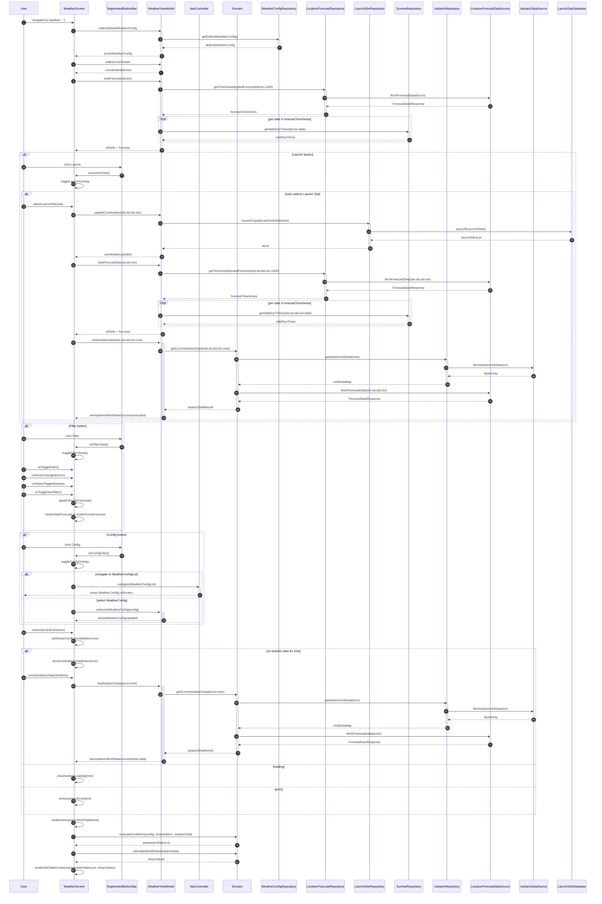

```mermaid
sequenceDiagram
    autonumber
    participant User
    participant WeatherUI as WeatherScreen
    participant BottomBar as SegmentedBottomBar
    participant WeatherVM as WeatherViewModel
    participant NavCtrl as NavController
    participant Domain
    participant ConfigRepo as WeatherConfigRepository
    participant LocRepo as LocationForecastRepository
    participant LaunchRepo as LaunchSiteRepository
    participant SunriseRepo as SunriseRepository
    participant GRIBRepo as IsobaricRepository
    participant ForecastDS as LocationForecastDataSource
    participant IsobaricDS as IsobaricDataSource
    participant RoomDB as LaunchSiteDatabase

    %% Initial navigation & config load
    User->>WeatherUI: navigateTo("weather/...")  
    activate WeatherUI
    WeatherUI->>WeatherVM: collectDefaultWeatherConfig  
    activate WeatherVM
    WeatherVM->>ConfigRepo: getDefaultWeatherConfig()  
    activate ConfigRepo
    ConfigRepo-->>WeatherVM: defaultWeatherConfig  
    deactivate ConfigRepo
    WeatherVM-->>WeatherUI: activeWeatherConfig  
    deactivate WeatherVM

    %% Coordinates & forecast load
    WeatherUI->>WeatherVM: collectCoordinates  
    WeatherVM-->>WeatherUI: coordinates(lat,lon)  
    WeatherUI->>WeatherVM: loadForecast(lat,lon)  
    activate WeatherVM
    WeatherVM->>LocRepo: getTimeZoneAdjustedForecast(lat,lon,120h)  
    activate LocRepo
    LocRepo->>ForecastDS: fetchForecastData(lat,lon)  
    ForecastDS-->>LocRepo: ForecastDataResponse  
    LocRepo-->>WeatherVM: forecastTimeSeries  
    deactivate LocRepo
    loop per date in forecastTimeSeries
        WeatherVM->>SunriseRepo: getValidSunTimes(lat,lon,date)  
        activate SunriseRepo
        SunriseRepo-->>WeatherVM: validSunTimes  
        deactivate SunriseRepo
    end
    WeatherVM-->>WeatherUI: uiState = Success  
    deactivate WeatherVM

    %% Segmented Bottom Bar interactions
    alt Launch button
        User->>BottomBar: click Launch  
        BottomBar->>WeatherUI: onLaunchClick()  
        WeatherUI->>WeatherUI: toggleLaunchOverlay  
        alt User selects Launch Site
            User->>WeatherUI: selectLaunchSite(site)  
            WeatherUI->>WeatherVM: updateCoordinates(site.lat,site.lon)  
            activate WeatherVM
            WeatherVM->>LaunchRepo: insertOrUpdateLastVisitedSite(site)  
            activate LaunchRepo
            LaunchRepo->>RoomDB: queryAllLaunchSites()  
            RoomDB-->>LaunchRepo: launchSitesList  
            LaunchRepo-->>WeatherVM: done  
            deactivate LaunchRepo
            WeatherVM-->>WeatherUI: coordinatesUpdated  
            WeatherUI->>WeatherVM: loadForecast(site.lat,site.lon)  
            activate WeatherVM
            WeatherVM->>LocRepo: getTimeZoneAdjustedForecast(site.lat,site.lon,120h)  
            activate LocRepo
            LocRepo->>ForecastDS: fetchForecastData(site.lat,site.lon)  
            ForecastDS-->>LocRepo: ForecastDataResponse  
            LocRepo-->>WeatherVM: forecastTimeSeries  
            deactivate LocRepo
            loop per date in forecastTimeSeries
                WeatherVM->>SunriseRepo: getValidSunTimes(site.lat,site.lon,date)  
                activate SunriseRepo
                SunriseRepo-->>WeatherVM: validSunTimes  
                deactivate SunriseRepo
            end
            WeatherVM-->>WeatherUI: uiState = Success  
            WeatherUI->>WeatherVM: loadIsobaricData(site.lat,site.lon,now)  
            activate WeatherVM
            WeatherVM->>Domain: getCurrentIsobaricData(site.lat,site.lon,now)  
            activate Domain
            Domain->>GRIBRepo: getIsobaricGribData(now)  
            activate GRIBRepo
            GRIBRepo->>IsobaricDS: fetchIsobaricGribData(uri)  
            IsobaricDS-->>GRIBRepo: ByteArray  
            GRIBRepo-->>Domain: GribDataMap  
            deactivate GRIBRepo
            Domain->>ForecastDS: fetchForecastData(site.lat,site.lon)  
            ForecastDS-->>Domain: ForecastDataResponse  
            Domain-->>WeatherVM: isobaricDataResult  
            deactivate Domain
            WeatherVM-->>WeatherUI: atmosphericWindStateSuccess(now,data)  
            deactivate WeatherVM
        end
    end

    alt Filter button
        User->>BottomBar: click Filter  
        BottomBar->>WeatherUI: onFilterClick()  
        WeatherUI->>WeatherUI: toggleFilterOverlay  
        %% User adjusts filters
        User->>WeatherUI: onToggleFilter()  
        User->>WeatherUI: onHoursChanged(hours)  
        User->>WeatherUI: onStatusToggled(status)  
        User->>WeatherUI: onToggleSunFilter()  
        %% Apply and re-render with filters
        WeatherUI->>WeatherUI: applyFiltersToForecast()  
        WeatherUI->>WeatherUI: renderDailyForecast & renderHourlyForecast  
    end

    alt Config button
        User->>BottomBar: click Config  
        BottomBar->>WeatherUI: onConfigClick()  
        WeatherUI->>WeatherUI: toggleConfigOverlay  
        alt navigate to WeatherConfigList
            WeatherUI->>NavCtrl: navigate(WeatherConfigList)  
            activate NavCtrl
            NavCtrl-->>User: show WeatherConfigListScreen  
            deactivate NavCtrl
        else select WeatherConfig
            WeatherUI->>WeatherVM: setActiveWeatherConfig(config)  
            activate WeatherVM
            WeatherVM-->>WeatherUI: activeWeatherConfigUpdated  
            deactivate WeatherVM
        end
    end

    %% Hourly card expand & isobaric data flow
    User->>WeatherUI: onHourlyCardClick(time)  
    WeatherUI->>WeatherUI: setHourlyCardExpanded(time,true)  
    alt no isobaric data for time
        WeatherUI->>WeatherUI: showGetIsobaricDataButton(time)  
        User->>WeatherUI: onGetIsobaricDataClick(time)  
        WeatherUI->>WeatherVM: loadIsobaricData(lat,lon,time)  
        activate WeatherVM
        WeatherVM->>Domain: getCurrentIsobaricData(lat,lon,time)  
        activate Domain
        Domain->>GRIBRepo: getIsobaricGribData(time)  
        activate GRIBRepo
        GRIBRepo->>IsobaricDS: fetchIsobaricGribData(uri)  
        IsobaricDS-->>GRIBRepo: ByteArray  
        GRIBRepo-->>Domain: GribDataMap  
        deactivate GRIBRepo
        Domain->>ForecastDS: fetchForecastData(lat,lon)  
        ForecastDS-->>Domain: ForecastDataResponse  
        Domain-->>WeatherVM: isobaricDataResult  
        deactivate Domain
        WeatherVM-->>WeatherUI: atmosphericWindStateSuccess(time,data)  
        deactivate WeatherVM
    else loading
        WeatherUI->>WeatherUI: showIsobaricLoading(time)  
    else error
        WeatherUI->>WeatherUI: showIsobaricError(time)  
    end

    %% Display wind data table
    WeatherUI->>WeatherUI: renderAtmosphericWindTable(time)  
    WeatherUI->>Domain: evaluateConditions(config, forecastItem, isobaricData)  
    Domain-->>WeatherUI: parameterStatesList  
    WeatherUI->>Domain: calculateWindShear(isobaricData)  
    Domain-->>WeatherUI: shearValues  
    WeatherUI->>WeatherUI: renderAWTableContents(parameterStatesList, shearValues)  

```